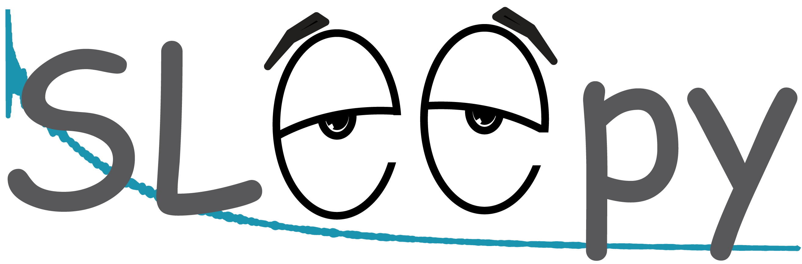

# SLEEPY
Simulation in Liouville space for rElaxation and Exchange in PYthon

This is a copy of SLEEPY, prepared for the Github CaCO3_archive repository. It is not the final version of SLEEPY, but is fully functional and is the version used for producing simulations found in the paper "Monohydrocalcite as a reference material to investigate amorphous calcium carbonate: an NMR perspective", by Vinod-Kumar, Smith-Penzel, Redrouthu, Gindele, Gebauer, and Mathies

The current version of SLEEPY may be found at
https://github.com/alsinmr/SLEEPY/

Copyright 2024 Albert Smith-Penzel

All files are copyrighted under the GNU General Public License. A copy of the license has been provided in the file LICENSE

Funding for this project provided by:

Deutsche Forschungsgemeinschaft (DFG) grant 450148812
